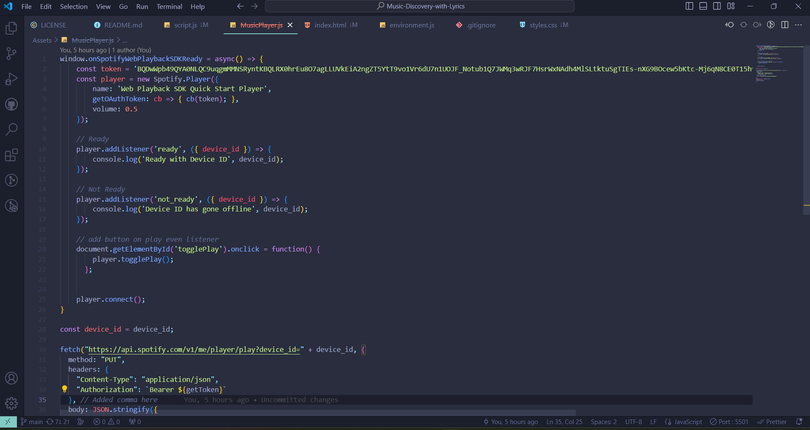
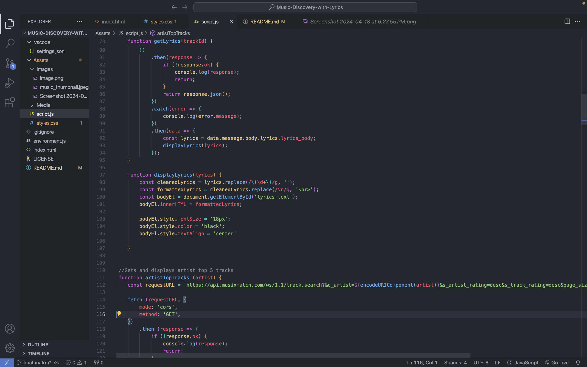
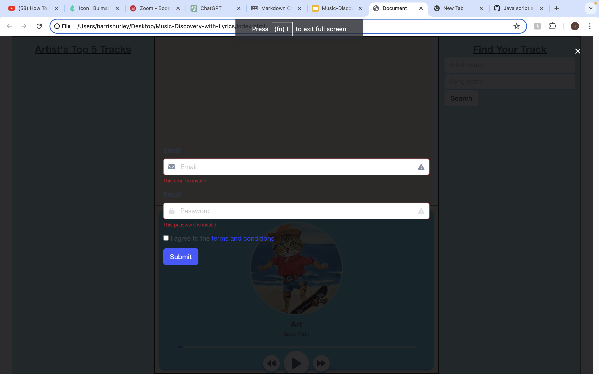
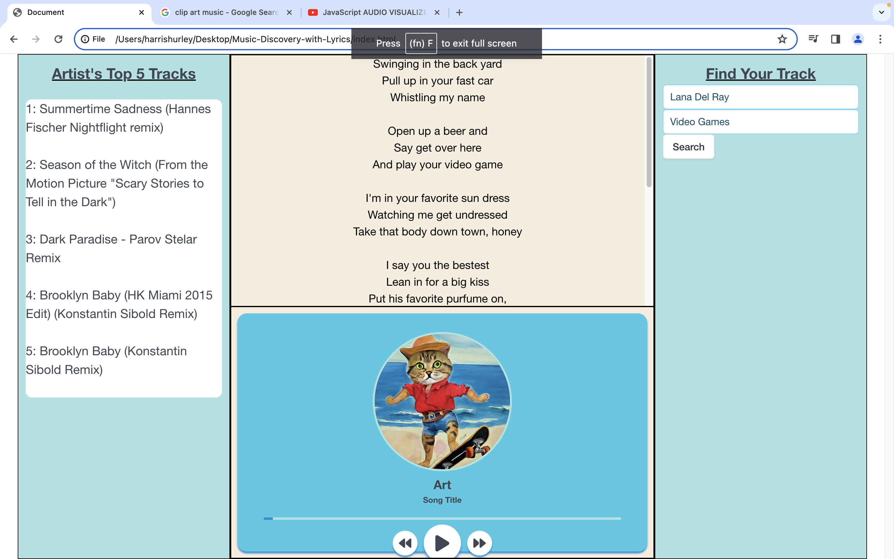

# Music Discovery with Lyrics

## Description
As a music enthusiast, I want to use a Music Discovery App, So that I can search for songs or artists on Spotify, and retrieve lyrics from MusiXMatch.

## Table of Contents
1. [Getting Started](#getting-started)
2. [Usage](#usage)
3. [Configuration](#configuration)
4. [API Reference](#api-reference)
5. [Examples](#examples)
6. [Screenshots](#screenshots)
7. [Dependencies](#dependencies)
8. [Installation](#installation)
9. [Contributing](#contributing)
10. [License](#license)
11. [Credits](#credits)
12. [Contact Information](#contact-information)

## Getting Started
To get started, please follow the steps below

## Usage
1. Sign in using spotify account info
2. Find your song using the Artist Name, and Song Name search boxes
3. Watch as lyrics are displayed in top center column, as well as the specified artist's top 5 tracks in the left column
4. Control playback with the music player in the bottom center container
5. Use the pause/play buttons to control playback
6. Use the fast forward and rewind buttons to control timing of the selected track

## Configuration
N/A

## API Reference
<<<<<<< HEAD

This code block initializes the Spotify Web Playback SDK, establishes a connection with the player, and defines event listeners for when the player is ready or not ready. Additionally, it includes logic to handle playing a track on the user's device using the Spotify API. The fetch function makes a PUT request to start playback on the user's device with a specific track URI.
i also created a get token to get access to spotify, This code snippet defines a login() function responsible for obtaining an access token from the Spotify API using client credentials authentication. It includes an inner async function getToken() to handle the token retrieval process, constructing the necessary headers and making a POST request to the Spotify API. 

musixmatch
root url: https://api.musixmatch.com/ws/1.1/
https://api.musixmatch.com/ws/1.1/track.search? - Provides many outputs. You can input artist name and track name in order to get a track id. You can also input just an artist name to get an array of track objects that includes information about the tracks.
https://api.musixmatch.com/ws/1.1/track.lyrics.get? - Inputs track id to get back lyrics.
2) Request must include in the header
mode: 'cors'
method: 'GET'
Response must be in json
3) An API key must be used to get back response details from the API calls. In order to get an API key with Musixmatch, you must go to their page (https://developer.musixmatch.com/) and sign up. From there, you will receive an email to activate your account. You will find the api key under Applications within the Dashboard.
=======

This code block initializes the Spotify Web Playback SDK, establishes a connection with the player, and defines event listeners for when the player is ready or not ready. Additionally, it includes logic to handle playing a track on the user's device using the Spotify API. The fetch function makes a PUT request to start playback on the user's device with a specific track URI.
i also created a get token to get access to spotify, This code snippet defines a login() function responsible for obtaining an access token from the Spotify API using client credentials authentication. It includes an inner async function getToken() to handle the token retrieval process, constructing the necessary headers and making a POST request to the Spotify API. However, the getToken() function is defined but not utilized within the provided code snippet.

>>>>>>> 88e77f0c43d29e85f3d63140fe654e38a1280b6a

## Examples
1. Selecting a Song:
- Description: Input the two search criteria first, Artist Name and Track Name
- Outcome: When a track has been selected, artist info will appear in the left column as well as the track in the music player
2. Viewing Lyrics:
- Description: When a track is selected, the lyrics for said track will be displayed in the top center container
- Outcome: After song has been selected through the search peramaters, lyrics will begin to appear in the container allowing the user to follow along with the track
3. Exploring Top 5 Tracks:
- Description: When a track is selected, the artist of said track and their top songs are displayed
- Outcome: The tracks are listed in left sidebar allowing the user more opportunity for disocver new tracks
## Screenshots
<<<<<<< HEAD

=======

>>>>>>> 88e77f0c43d29e85f3d63140fe654e38a1280b6a

## Dependencies
- Must have a Spotiy account to be able to login

## Installation
N/A

## Contributing
If you'd like to contribute to My Project, please email [Harris Hurley](harrismhurley@icloud.com) with any inquirys.

## License
My Project is licensed under the [MIT License](LICENSE).

MIT License

Copyright (c) 2024 Innovative-J

Permission is hereby granted, free of charge, to any person obtaining a copy
of this software and associated documentation files (the "Software"), to deal
in the Software without restriction, including without limitation the rights
to use, copy, modify, merge, publish, distribute, sublicense, and/or sell
copies of the Software, and to permit persons to whom the Software is
furnished to do so, subject to the following conditions:

The above copyright notice and this permission notice shall be included in all
copies or substantial portions of the Software.

THE SOFTWARE IS PROVIDED "AS IS", WITHOUT WARRANTY OF ANY KIND, EXPRESS OR
IMPLIED, INCLUDING BUT NOT LIMITED TO THE WARRANTIES OF MERCHANTABILITY,
FITNESS FOR A PARTICULAR PURPOSE AND NONINFRINGEMENT. IN NO EVENT SHALL THE
AUTHORS OR COPYRIGHT HOLDERS BE LIABLE FOR ANY CLAIM, DAMAGES OR OTHER
LIABILITY, WHETHER IN AN ACTION OF CONTRACT, TORT OR OTHERWISE, ARISING FROM,
OUT OF OR IN CONNECTION WITH THE SOFTWARE OR THE USE OR OTHER DEALINGS IN THE
SOFTWARE.

## Credits
- [Brooke Dunlap](https://github.com/brooke-dunlap)
- [Juan Garcia](https://github.com/Innovative-J)
- [Harris Hurley](https://github.com/harrismhurley)

## Contact Information
For questions or feedback, please contact me at [harrismhurley@icloud.com](harrismhurley@icloud.com).
